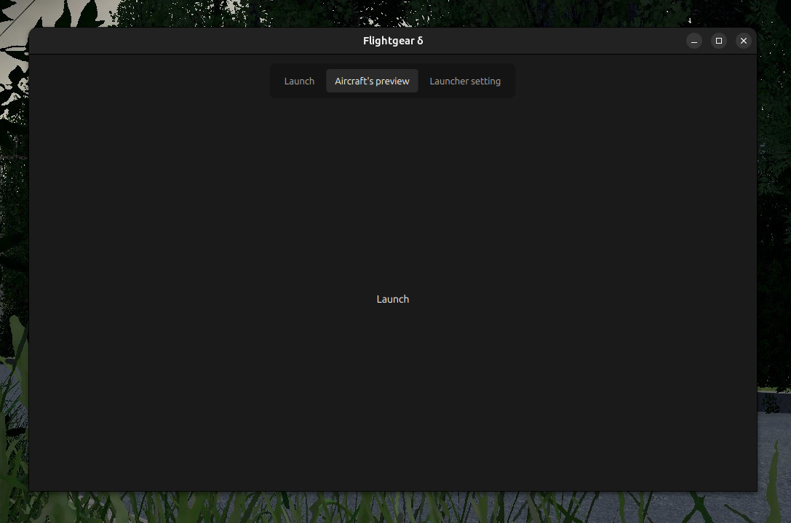
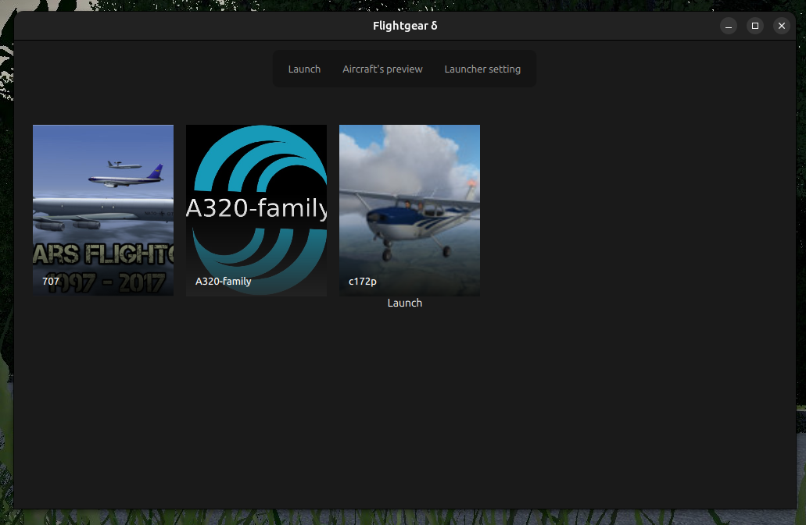

# FlightGear δ (delta)

Now that is something interesting. **This project is in progress... and, well, frozen at the same time**.

**FlightGear δ** is a (yet still) solo-made project, which adds a new launcher for [FlightGear Flight Simulator](https://www.flightgear.org/). The best way to describe the project is "When a half-designer decides he's a half-programmer". Though I must admit! I'm not either.

I'm trying to make myself keep working on this project, but nah, too lazy. Sometimes I add some fixes.

## Tech stack

Built with C++ and Qt5/QML (Qt Quick), using `QQmlApplicationEngine` for the UI and a native `LaunchManager` C++ backend exposed to QML for filesystem access, process launching, and settings persistence.

## Functionality (and roadmap)

- [x] First-run setup (pick and validate your FlightGear data root)
- [x] Aircraft scanning (`Aircraft/` directory, `*-set.xml` detection)
- [x] Aircraft thumbnails with fallback image
- [x] Aircraft detail panel (description, author, rating, scrollable)
- [ ] Interface polish [in progress, design ideas sketched out]
- [ ] Location and environment choose pages
- [ ] Settings page
- [ ] Presets system
- [ ] Launch (finally, yes) — basic `fgfs` process spawning exists, needs real argument building from UI state
- [ ] Localization (i18n scaffolding in place, translations not yet written)

Soon here will be some more description, when I'm not as lazy.

By Andrei Panov, started in 2026.

## Some screenshots

**10.6.2026**

---

**24.7.2026**
